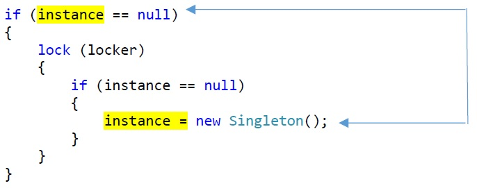

# Double Checked Locking Sample

## Issue Description (Data Race, Requires Volatile)
* Double Checked Locking is a design pattern (or anti-pattern) from POSA (patterns of software architecture).
* The pattern is broken if implemented one-to-one in languages like C# (also Java, C++, and others).
* Two threads may call `Singleton.Instance`: Only one may acquire the lock and create the instance.
* While writing the instance in the lock, another thread may read the unsynchronized instance variable in the (outer) if-condition. Note that `instance ?? new Singleton();` stands for `if (instance != null) instance = new Singleton();`, representing an implicit inner if-condition.
* Both accesses can happen concurrently and are not mutually synchronized. Only one side holds the lock, the other not.*
* This is a data race, a formal programming error.
* In practice, parts of the constructor execution could be reordered after the assignment of the new created object to instance. The latter may happen with an optimizing compiler, runtime system (liberty allowed by the language specification), or a processor such as ARM. (Intel processor write instructions are not reordered.) It can thus lead to real race condition and is thus considered broken.

File `Program.cs`:

    ...
    if (instance == null) // READ ACCESS INVOLVED IN DATA RACE
    {
        lock (locker)
        {
            instance ??= new Singleton(); // WRITE ACCESS INVOLVED IN DATA RACE
        }
    }

## Visualization

## Checker Output (1 Issue, 2 Locations)

    Issue: #0 Data race on DoubleCheckedLocking.Singleton.instance	DoubleCheckedLocking	C:\Daten\GitHub\parallelchecker\doc\samples\4_DoubleCheckedLocking\DoubleCheckedLocking\Program.cs	21	Active	Data race on DoubleCheckedLocking.Singleton.instance
        caused by write at "instance ??= new Singleton()" in Program.cs line 25
            caused by access DoubleCheckedLocking.Singleton.Instance at "Singleton.Instance" in Program.cs line 37
            caused by thread or task at "() => Console.WriteLine(Singleton..." in Program.cs line 37
                caused by call DoubleCheckedLocking.Program.Main()
                caused by initial thread at "Main" in Program.cs line 35
        caused by read at "instance" in Program.cs line 21
            caused by access DoubleCheckedLocking.Singleton.Instance at "Singleton.Instance" in Program.cs line 38
            caused by thread or task at "() => Console.WriteLine(Singleton..." in Program.cs line 38
                caused by call DoubleCheckedLocking.Program.Main()
                caused by initial thread at "Main" in Program.cs line 35

## Problem Fixing (2 Options)

### Option 1: Volatile Variable

Declare the variable instance as `volatile`, imposing memory fences/barriers on the accesses. Certain reordering is thereby prohibited, i.e. the constructor must complete before the write on instance. 

File `Program.cs`:

    ...
    private static volatile Singleton instance; // VOLATILE DECLARATION ADDED

### Option 2: Explicit Volatile Accesses

Use explicit Volatile read and write accesses: 

File `Program.cs`:

    ...
    if (Volatile.Read(ref instance) == null) // VOLATILE READ
    {
        lock (locker)
        {
            if (instance == null)
            { 
                Volatile.Write(ref instance, new Singleton()); // VOLATILE WRITE
            }
        }
    }
    return instance;

